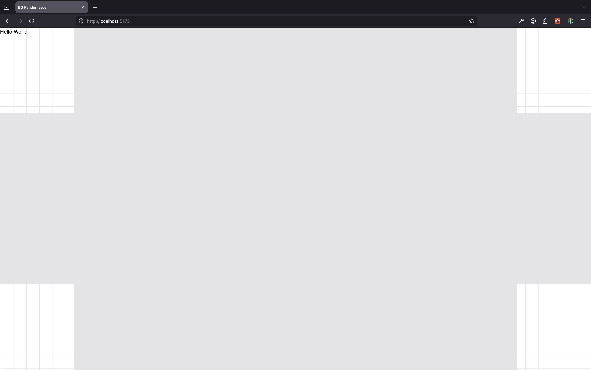
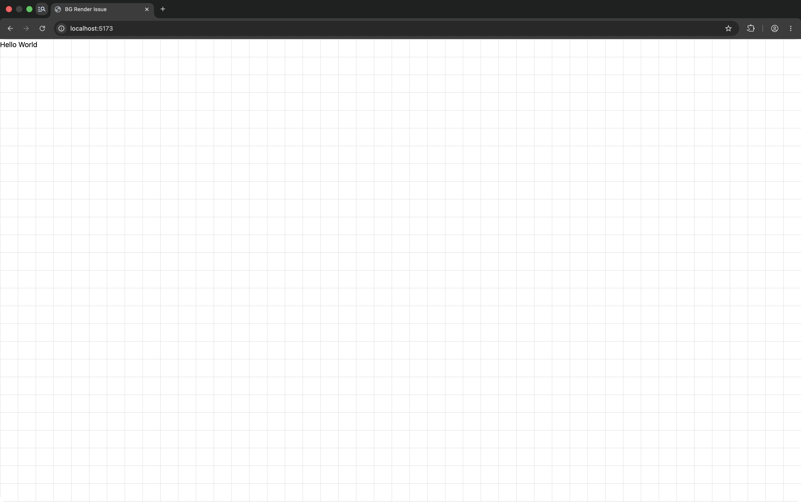
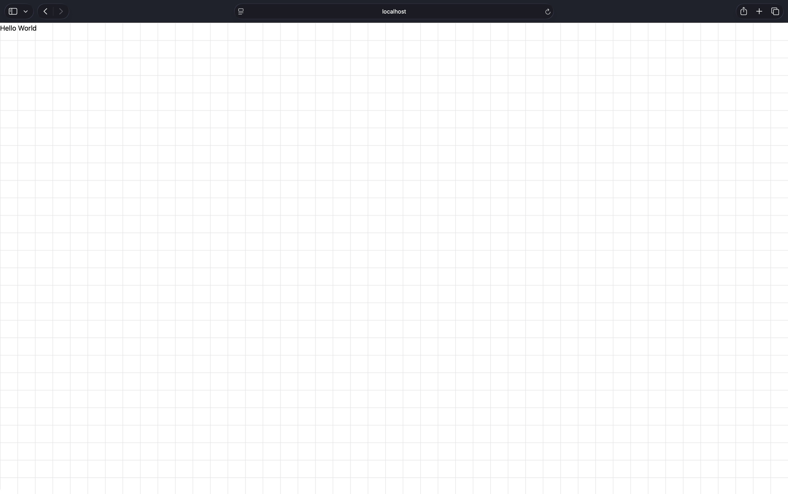

# Minimum Reproduction of CSS Rendering Issue in Latest Firefox DE

1. Install dependencies: `bun install`
2. Start dev server: `bun run dev`
3. Open `http://localhost:5173` in Firefox Developer Edition (150.0b4)

## Levers

CSS involved to reproduce the bug can be found in:
- [App](src/App.tsx)
- [index.css](src/index.css)

Commenting out any of the Tailwindcss classes found in App.tsx will make the render bug disappear. I tried to trim this down to the absolute bare minimum I could.

## Previews

### Firefox Developer Edition 150.0b4

### Firefox 149.0

### Chrome Canary 148.0.7768.0

### Safari 26.2

